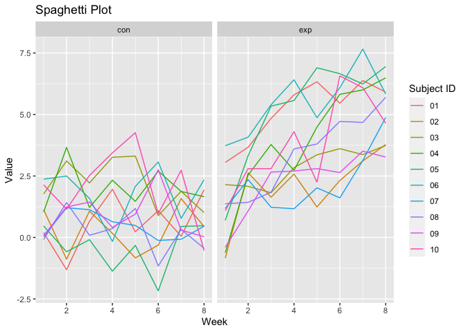
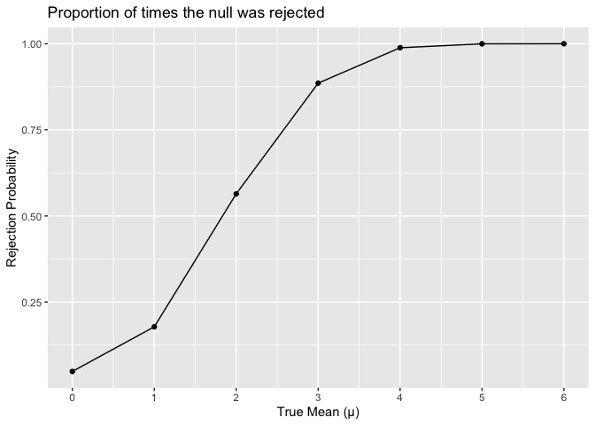
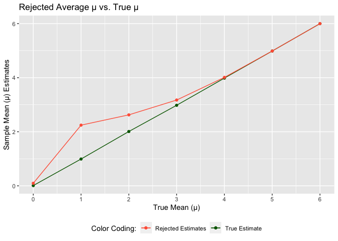

P8105_hw5_wz2630
================

``` r
# Intall packages
library(tidyverse)
library(readr)
library(purrr)
library(ggplot2)
```

# Problem 1

(not graded)

# Problem 2

Longitudinal study

Create a tidy dataframe containing data from all participants, including
the subject ID, arm, and observations over time:

``` r
data_files = tibble(filename = list.files("./data/"))
# csv files I want to read in

read_csv = function(csv, path = "./data/") {
  paste(path, csv, sep = "/") |> 
  read.csv()
}
# create function for reading csv files

longitudinal_study =  
  data_files |> 
  mutate(nested_data = map(data_files$filename, read_csv)) |> 
  #list of datasets to apply read_csv function to
  unnest(nested_data) |> 
  #unnests data into all 8 columns
  mutate(arm_subject = map_chr(.x = filename, ~ unlist(str_split(.x, "\\.") ) [[1]] )) |> 
  #create new column to rename subjects by splitting with '.' and using only the first part
  mutate(arm = map_chr(.x = arm_subject, ~ unlist(str_split(.x, "_") ) [[1]] )) |> 
  mutate(subject_id = map_chr(.x = arm_subject, ~ unlist(str_split(.x, "_") ) [[2]] )) |> 
  #separate into arm and subject id columns
  select(-filename, -arm_subject)
  #only keep necessary columns of tidy dataset
```

Make a spaghetti plot showing observations on each subject over time,
and comment on differences between groups.

``` r
#pivot longer data in order to create graph over time
pivot_longer = 
  longitudinal_study |> 
  pivot_longer(week_1:week_8,
               names_to = "week",
               names_prefix = "week_", #removes the week prefix in the week values
               values_to = "value") |> 
  mutate(week = as.integer(week))

spaghetti_plot = 
  pivot_longer |> 
  ggplot(aes(week, value, color = subject_id)) + 
  geom_line() + 
  facet_wrap(~arm) + 
  labs(x = 'Week', y = 'Value', title = 'Spaghetti Plot', color = "Subject ID")

spaghetti_plot
```

<!-- -->

**Comments:**

Since we are asked to compare between the 2 arms (control and
experimental), I applied facet_wrap to better visualize it. The control
arm have overall lower values throughout the 8 weeks as compared to the
experimental arm which has an overall increasing trend. The control arm
also has much more variability and fluctuations throughout the 8 weeks
with no apparent trend.

# Problem 3

Simulation to explore power in a one-sample t-test

- Fix n=30
- Fix σ=5

**Simulation**

``` r
set.seed(123)

# generate function for simulation
sim_t_test = function(n = 30, mu, sd = 5) {
  x_vec = rnorm(n, mu, sd)
  t.test(x_vec) |> 
  broom::tidy() |> 
  select(mu_hat = estimate, p_value = p.value)
}
```

μ = 0

``` r
output = vector("list", length = 5000)

for (i in 1:5000) {
  output[[i]] = sim_t_test(mu = 0)
}

# simulation result
t_test_result =
  bind_rows(output)
```

Repeat the above for μ = {1,2,3,4,5,6}

``` r
more_ttest_sim = 
  expand_grid(mu_vals = c(0, 1, 2, 3, 4, 5, 6), 
              iter = 1:5000) |> 
  mutate(estimates_data = map(mu_vals, ~sim_t_test(n = 30, mu = .))) |> 
  unnest(cols = c(estimates_data))
```

## Plot 1

Make a plot showing the proportion of times the null was rejected (the
power of the test) on the y axis and the true value of μ on the x axis.

``` r
plot1 = 
  more_ttest_sim |> 
    group_by(mu_vals) |> 
    summarize(rejected = sum(p_value < 0.05) / 5000) |> 
    ggplot(aes(x = mu_vals, y = rejected)) +
    geom_point() + 
    geom_line() + 
    labs(x = 'True Mean (μ)', y = 'Rejection Probability', title = 'Proportion of times the null was rejected') + 
    scale_x_continuous(limits = c(0, 6), breaks = seq(0, 6, 1))

plot1
```

<!-- -->

**Describe the association between effect size and power:**

The graph demonstrates a positive association – as true mu values
increase, the proportion of times the null is rejected (power) also
increase. This is because a larger effect size is associated with
increased statistical power, making it easier to detect a statistically
significant difference.

## Plot 2

Make a plot showing the average estimate of μ̂ on the y axis and the true
value of μ on the x axis.

Make a second plot (or overlay on the first) the average estimate of μ̂
only in samples for which the null was rejected on the y axis and the
true value of μ on the x axis.

``` r
estimates_data <-
  more_ttest_sim |> 
  group_by(mu_vals) |> 
  summarize(sample_mean_estimates = mean(mu_hat))

estimates_rejection_df =
  more_ttest_sim |> 
  mutate(decision_rule = ifelse(p_value < 0.05, "reject", "fail to reject")) |> 
  filter(decision_rule == "reject") |> 
  group_by(mu_vals, decision_rule) |> 
  summarize(sample_mean_estimates = mean(mu_hat))
```

    ## `summarise()` has grouped output by 'mu_vals'. You can override using the
    ## `.groups` argument.

``` r
plot2 = 
  ggplot() + 
  geom_point(data = estimates_data, aes(x = mu_vals, y = sample_mean_estimates, color = "True Estimate")) + 
  geom_line(data = estimates_data, aes(x = mu_vals, y = sample_mean_estimates, color = "True Estimate")) +
  geom_line(data = estimates_rejection_df, 
            aes(x = mu_vals, y = sample_mean_estimates, color = "Rejected Estimates")) + 
  geom_point(data = estimates_rejection_df, 
             aes(x = mu_vals, y = sample_mean_estimates, color = "Rejected Estimates")) + 
  labs(x = 'True Mean (μ)', y = 'Sample Mean (μ) Estimates', 
       title = 'Rejected Average μ vs. True μ', color = "Color Coding:") + 
  scale_color_manual(values = c("Rejected Estimates" = "tomato", "True Estimate" = "darkgreen")) + 
  scale_x_continuous(limits = c(0, 6), breaks = seq(0, 6, 1)) + 
  theme(legend.position = "bottom")
  
plot2
```

<!-- -->

**Is the sample average of μ̂ across tests for which the null is rejected
approximately equal to the true value of μ? Why or why not?**

When the true mean is less than 4, the rejected sample mean mus are
different compared to the true means because effect size and power is
small. However, when the mean is 4 or larger, the rejected sample mean
mus are about the same as the true mu because both effect size and power
are larger.
